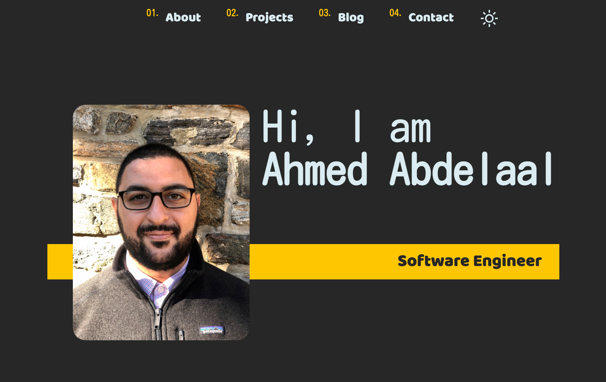
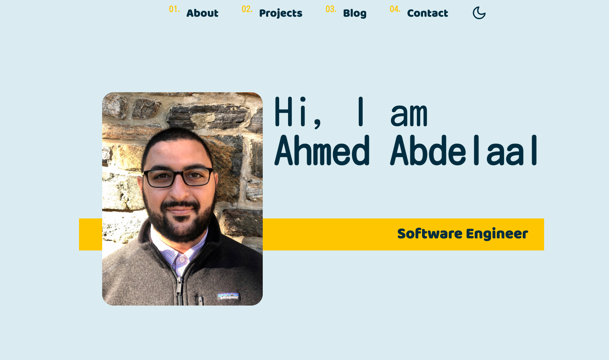

# 💻 Peronal Website

[](https://app.netlify.com/sites/boring-benz-607be6/deploys)

<p align="center">
  The second iteration of <a href="https://aa-dev.io/" target="_blank">aa-dev.io</a> built with <a href="https://www.gatsbyjs.org/" target="_blank">Gatsby</a> and hosted with <a href="https://www.netlify.com/" target="_blank">Netlify</a>
</p>

<p align="center">
  Checkout the previous iteration (v1) <a href="https://shrki416.github.io/Portfolio-Site/">Here</a>
</p>




## 🛠 Installation & Set Up

1. Install the Gatsby CLI

   ```sh
   npm install -g gatsby-cli
   ```

2. Install dependencies

   ```sh
   npm install
   ```

3. Start the development server

   ```sh
   gatsby develop
   ```

## Summary

This website is made with Gatsby and hosted on Netlify. It is the second iteration of my personal website. I wanted to make my personal site with React, and I ended up picking up Gatsby in the process. It wasn't easy, but it was a lot of fun to make.

### Author

- Ahmed Abdelaal - [Website](https://aa-dev.io/) | [LinkedIn](https://www.linkedin.com/feed/)
