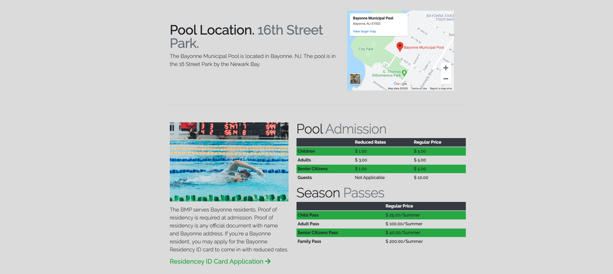

# Bayonne <strong>Municipal Pool</strong>

BMP

This project uses Bootstrap 4

I wanted to learn how to use Bootstrap and our hometown pool doesn't
have a website. I thought this would be a perfect opportunity to learn
Bootstrap by creating this website entirely with Bootstrap. This website
has many of Bootstrap's components such as modals, navbar, forms,
carousels, and more. Learning how Bootstrap implements it's design
choices helped me learn more about CSS.

<a href="http://bmpnj.com/" class="btn">Visit Website</a>
