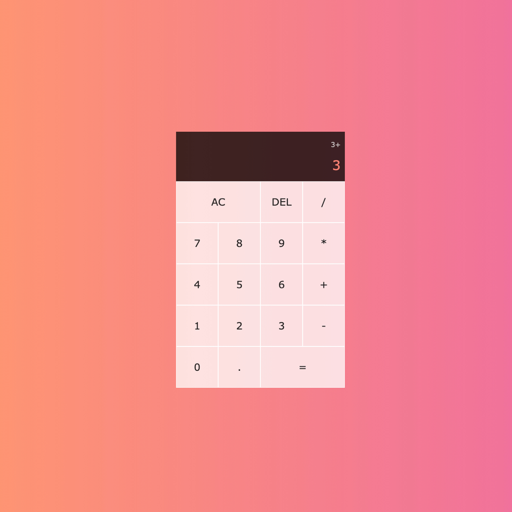

# Vanilla JS<strong>Calculator</strong>

JS Calculator

This project is built entirely with pure vanilla JavaScript, styled with
CSS grid and hosted using gitHub pages.

I was excited to code up a calculator. I mean it's easy! how hard can it
be to make a calculator?! I was soon to find out.

I was definitely fooled by how complex a "simple" calculator can be.
Specially starting to code. No frameworks were chosen for this project.
The idea is to continue to work on improving my JavaScript and CSS
skills. That's exactly what this project delivered on! This project
taught me how to approach and think aobut problems like a programmer and
how to find and implement creative solutions.

<a href="https://shrki416.github.io/Calculator-App/" class="btn">Visit Website</a>
