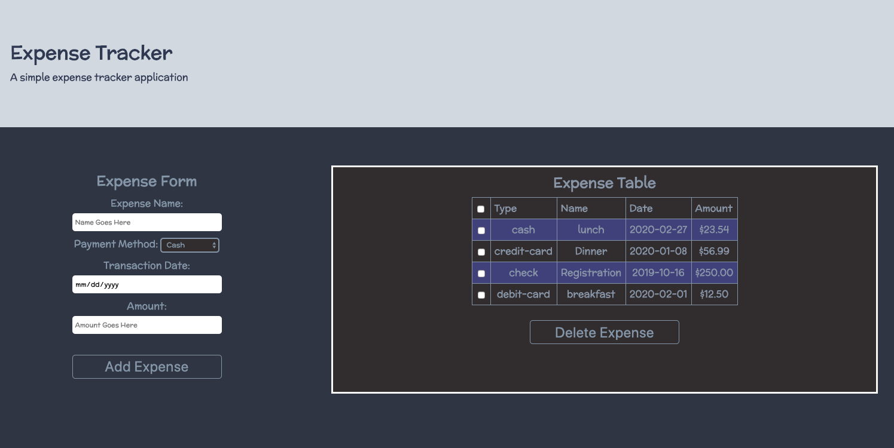

Expense Tracker is built with React and is deployed on Heroku. Using
React on this project I can see why developers like using it and why
it's becoming the most popular JS FE framework/library.

This is a simple React App that tracks expenses. This is a great project
to learn about state, components, and passing data between components
via props. In this application the user is able to add and delete
expenses using a form. The data from this application persists in the
browser using localStorage.

<a class="btn" href="https://polar-sands-39515.herokuapp.com/">Visit Website</a>
<a class="btn" href="../">Home</a>
