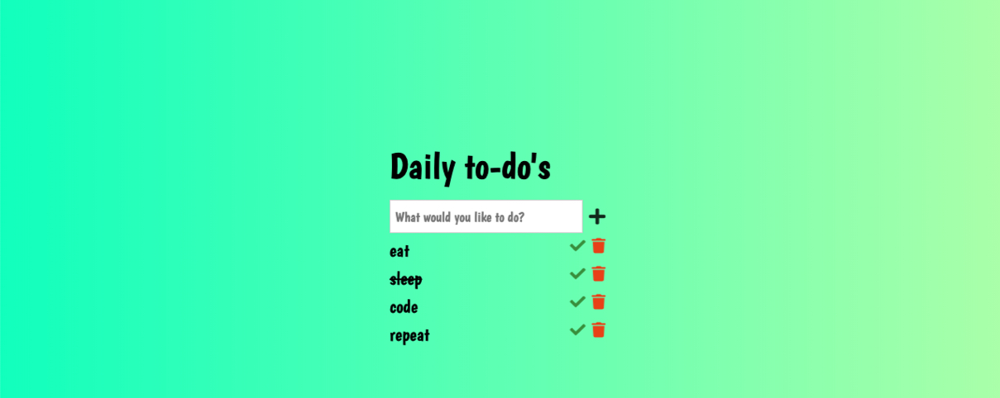

A todo list application. It's a right of passage for any new developer
learning to code.

Building a todo app is important to new developers because you learn
many key concepts like working with the DOM, functional programming,
using localStorage, and working with inputs and forms. This was my first
true introduction to the above.

<a class="btn" href="https://shrki416.github.io/ToDo-App/">Visit Website</a>
<a class="btn" href="../">Home</a>
