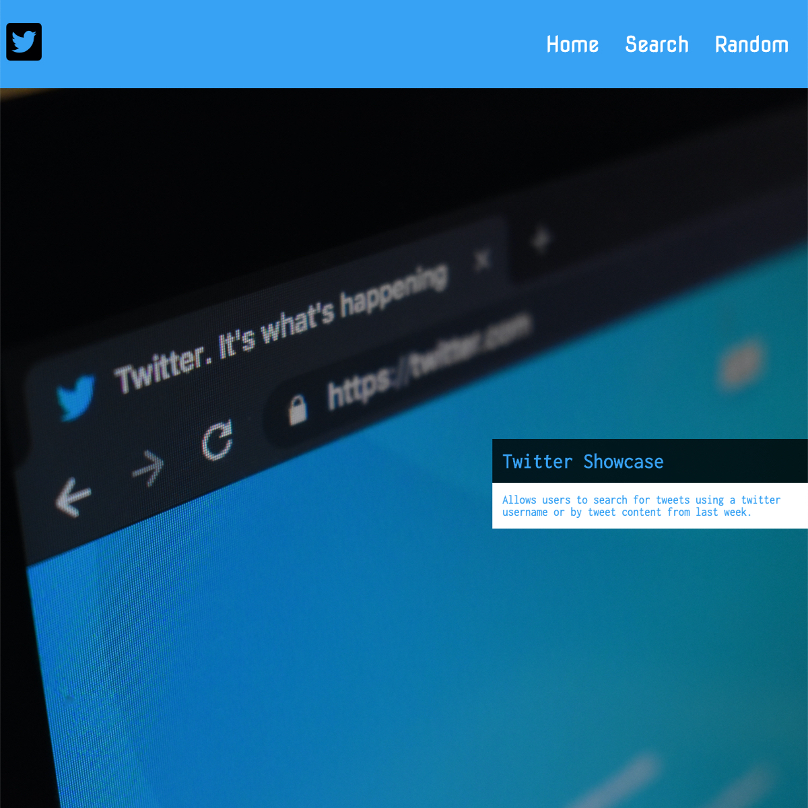
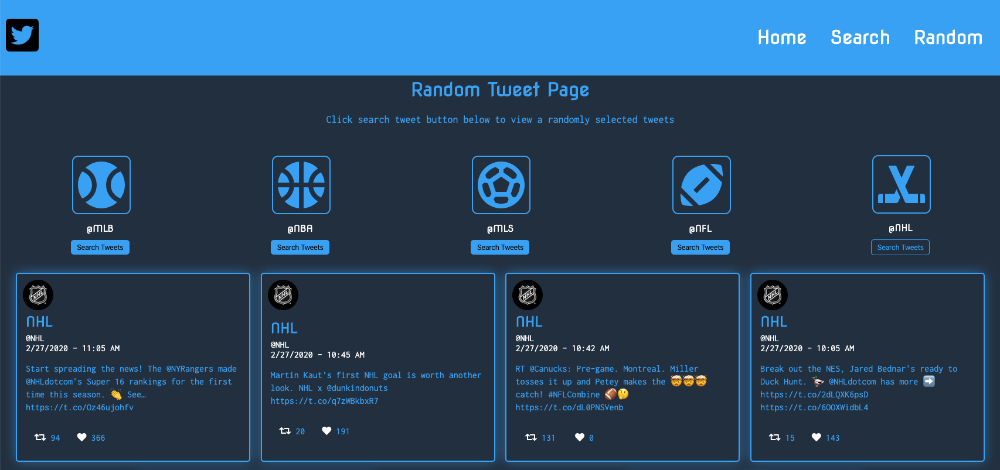

# Twitter <strong>Showcase App</strong>

Twitter Showcase

This is fun web application that utilizes data from the Twitter's API to
allow a person to search for recent tweets of Twitter users.

This application was a lot of fun to build. It challenged my in many
ways. I'm so glad I was able to complete this challenge as it taught me
a ton and leveled up my skills that much more. I learned how to work
with APIs. How to connect client-side with server-side as well as
connecting to external APIs.

I ran into many small bugs that allowed me to come up with creative
solutions to fix. I learned a lot about React-Router and React Hooks,
and I was able to implement both in this project. I learned more about
CSS grid and flexbox. Thus, as a result the application is fully
responsive. As a I continue to learn, it would be so much fun to
continue to grow this application and add features to it in the future.

<a href="https://frozen-dusk-41164.herokuapp.com/">Visit Website</a>
